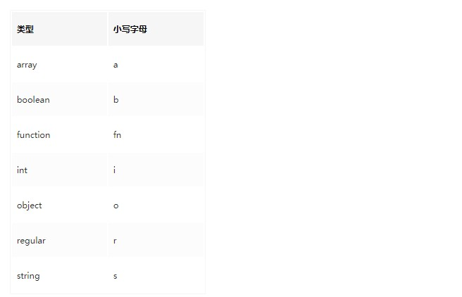
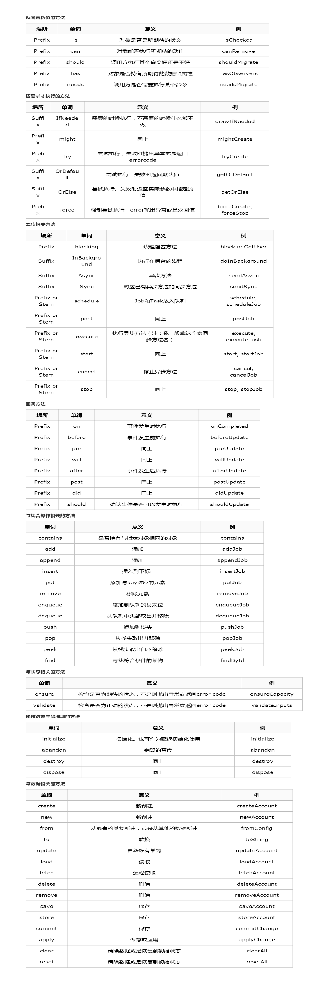
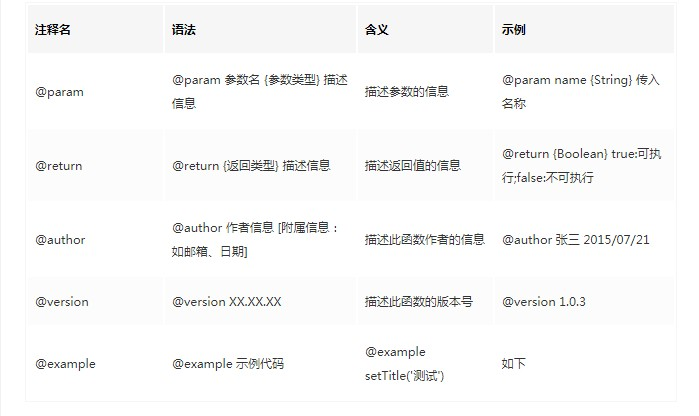
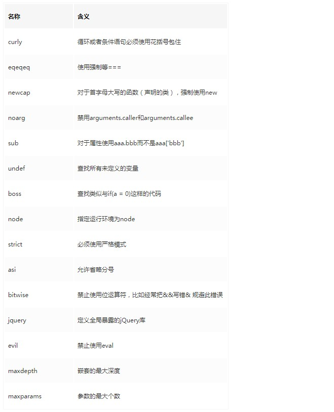

# 命名规范：
命名在程序中是很重要的，一个不好的命名，可能会引起别人错误理解，对开发效率，项目的质量影响很大；从维护项目上，遵循一套严格的命名规范，无论是对自己还是接手的他人，都会大大降低代码的维护成本，想要成为一名合格的前端开发，学习命名规范是必须的

## 错误样例：
* 1.单词拼写错误

```js
submitFrom(){...}
// 提交表单(把 Form 写成了 From)
```
* 2.强制中文拼音命名

```js
wenzhangliebiao
articleList
//但是偏偏有时候就算有英文的单词，有些人还是用中文拼音命名，比如一个文章列表，很多人就是没用 articleList，直接写 wenzhangliebiao。但是看的时候，一定会懵逼一会
```
* 3.中英文混用

```js
let chanpinList=[];
// 这个变量名，一开始不知道是什么，注释也没有，完全懵逼。后来看了需求，才知道这个的意思是：产品列表。
```
* 4.以1-9，a-z命名

```js
btn1，btn2，btn3，btn4...
btnA，btnB，btnC，btnD
// 比如页面上有几个按钮，有人命名成上边这样的 。这样的命名看似简单，但实际上从这些命名里面读取不到任何信息，以后会可能会痛苦些。
```
* 5.混用命名格式

```js
comments
comment-list
commentList
// 几种规范混在一起，就感觉不规范了。还有就是相同功能的函数，命名却不一样，这样的话就极容易在维护的时候造成困惑。
```
* 6.强制简写

```js
ac
addComment 
tjyhpl
handleCommentSubmit/submitComment/publishComment
// 如此这般的缩写方式会不会让你觉得头疼脑热，有些提刀的冲动~
```
* 7.单复数不分

```js
orderData
ordersData
// 对于单复数的情况我们遇到的比较少，但是在单复数的使用中我们也应该注意的是，尽量使用相应的数量表达，总而言之，还是说维护的便利性和代码的可读性
```
* 8.正反义词错用

```js
showEditDialog --- closeEditDialog
// 上面的案例，show 和 close ，一个是显示，一个是关闭，显然不是正反义词
showEditDialog --- hideEditDialog 
openEditDialog --- closeEditDialog 
// 这样就好多了,show和hide,显示与隐藏。open对close,开与关。
```
* 9.为所欲为的命名

```js
w_name，w_high，w_length 
// 以自己的姓开头

int a0813;
// 这是8月13号写的....
```
---
## 规范的必要：
:::tip
项目组的各方面不统一，不好维护，千奇百怪？</br>
提交代码的时候总要拉某某人过来看下各种冲突？</br>
merge代码的时候总要话很长的时间去解决不同格式的代码冲突？</br>
人人都在恐慌，人人都在责怪他人，但殊不知，换了好几个项目都是类似，想过为什么吗？</br>
你是不是有时候为了解决一个bug好几天没睡好，最终定位的问题也许是一个分号、或是书写规范？
:::


由以上种种不管是错误实例还是我们开发中遇到的难点痛点，我们都能理解到规范的命名方式对我们会有多大的帮助，
因此如何命名，怎样规范的命名就是我们迫切应该思考并用以实践的技能，
那么我们如何写出让别人一读就懂的代码，如何写出利于团队维护更迭的代码，如何写出让我们拿得出手不会让人笑话的代码呢？下面我们就来看一看

## 前端规范：
::: tip
* 语义化(装资深大佬)：
    相对规范的语义内容，俗称的见名知意，根据变量或者函数的名字就能了解到这个变量或者函数的功能。方便我们维护扩展自己的代码或者是公用仓库中的内容。

* 规范化(省的被骂)：
    规范化的代码的好处就是利于后期的维护更迭，能更清楚的知道代码的结构内容，不会在维护代码的过程中想拿头撞墙，能更清楚的按统一的代码规范去走，对团队对自己是益处颇大的。

* 国际化(显摆四级)：
    国际化的规范就是说我们尽量的不去做带着浓重乡土气息的命名，这对于我们的开发来说肯定是能更加体现自身素养的一件事，好的代码一定是可以推广开的，我们也一直在做的就是尽量的多做一些可以能提供给更多人使用的一些模块工具，相信大家都不想看到其他人用这个模块的时候出现“ergazi(二嘎子)”类似的引人喷饭的变量命名。

* 健壮性(不想找事)：
    这些特性来说其实是在代码规范中体现的更加多一些，但是我还是放到了前端规范中来，健壮性一定是我们要费心费力去做的一件事，这个直接关乎到我们程序代码的强壮程度，我们不能写出那种经不住冲击经不住测试的代码，这个规范的健壮性体现的范围很多，这里不做展开，仔细讲来的话估计也是一整堂课了。
:::

前端规范远远大于这篇文档中所理解的这些，这里只是简单的罗列一些我们应该最值得注意的问题，对于其他的内容其实大家可以在下边自己搜索，互相分享，能更好的促成互助进步的工作学习氛围

---
# 列举规范：

## 资源文件规范
目录，文件名称的命名规则

    a.文件名不得含有空格。
    b.文件名建议只使用小写字母，不使用大写字母。( 为了醒目，某些说明文件的文件名，可以使用大写字母，比如README、LICENSE)。
    c.文件名包含多个单词时，单词之间建议使用半角的连词线 ( - ) 分隔。
    d.引入资源使用相对路径，不要指定资源所带的具体协议 ( http:,https: ) ，除非这两者协议都不可用。
## HTML正确规范
在HTML中主要注重的是内容的呈现，尽量将样式，逻辑和内容做最大程度的分离，职责专一，目标明确。由HTML完整的树状DOM结构将整体内容包装起来
* 1.坚持正常的树状DOM结构
```html
  <ul class="ui-nav">
    <li class="ui-nav-item"> some text
      <ul class="ui-nav-item-child">
        <li> some text
          <ul class="ui-list">
            <li class="ui-list-item"> some text</li>
          </ul
        ...
       </ul>
    </li>
    <li
    ...
  </ul>

  /* 推荐嵌套层级，但是尽量少一些冗余嵌套，保持整个树状结构的简洁完整性 */
```
* 2.结构、表现、行为三者分离
:::tip
* html部分负责的是内容的呈现，主要是对数据的渲染，尽量将数据部分的展示放到这块来处理，并由此产生固定的结构。
* css作为主要的内容样式渲染，将页面的展示样式放于此处，尽量减少内部样式的置入以减少和html部分的耦合情况。
* javascript作为动态的行为控制，尽量不要由此部分注入样式或者是产生DOM结构，这些操作有可能会引起页面的重新加载或者是页面部分的重新渲染，由此带来的系统开销也是相当巨大的。
:::
## CSS正确规范
css是控制页面展现的静态样式，做到和页面展示相分离之后，我们也应该注意一些样式内部使用时候的一些规范，以提升我们产品性能和用户的使用感
* 1.命名规范
:::tip
* class 应以功能或内容命名，不以表现形式命名
* class 与 id 单词字母小写，多个单词组成时，采用中划线-分隔
* 使用唯一的 id 作为 Javascript hook, 同时避免创建无样式信息的 class
:::
* 2.书写规范
:::tip
* 统一两个空格缩进
* 属性声明结尾加分号
* 采用展开格式，不是用紧凑格式
* 为了避免内容乱码，统一使用 UTF-8 编码保存
* 选择器与左括号之间一个空格，属性冒号后一个空格
:::
* 3.id和class的命名
```css
/* ID和class的名称总是使用可以反应元素目的和用途的名称，或其他通用的名称，代替表象和晦涩难懂的名称 */

/* 不推荐 : */

.fw-800 {
  font-weight: 800;
}

.red {
  color: red;
}

/* 推荐 */

.heavy {
  font-weight: 800;
}

.important {
  color: red;
}

```
* 4.慎用id
```css
/* 一般情况下ID不应该被用于样式，并且ID的权重很高，所以不使用ID解决样式的问题，而是使用class */

/* 不推荐： */

#content .title {
  font-size: 2em;
}

/* 推荐： */

.content .title {
  font-size: 2em;
}

```
* 5.css选择器中避免使用标签名
```
从结构、表现、行为分离的原则来看，应该尽量避免css中出现HTML标签，并且在css选择器中出现标签名会存在潜在的问题。
```
* 6.使用子选择器
```css
/* 很多前端开发人员写选择器链的时候不使用 直接子选择器（注：直接子选择器和后代选择器的区别）。有时，这可能会导致疼痛的设计问题并且有时候可能会很耗性能。然而，在任何情况下，这是一个非常不好的做法。如果你不写很通用的，需要匹配到DOM末端的选择器， 你应该总是考虑直接子选择器。 */

/* 不推荐: */

.content .title {
  font-size: 2rem;
}
/* 推荐 */

.content > .title {
  font-size: 2rem;
}

```
* 6.尽量使用缩写属性
```css
/* 尽量使用缩写属性对于代码效率和可读性是很有用的，比如font属性 */
/* 不推荐： */
{
    border-top-style: none;
    font-family: palatino, georgia, serif;
    font-size: 100%;
    line-height: 1.6;
    padding-bottom: 2em;
    padding-left: 1em;
    padding-right: 1em;
    padding-top: 0;
}

/* 推荐： */
{
    border-top: 0;
    font: 100%/1.6 palatino, georgia, serif;
    padding: 0 1em 2em;
}
```
* 7.属性格式
:::tip
* 为了保证一致性和可扩展性，每个声明应该用分号结束，每个声明换行。
* 属性名的冒号后使用一个空格。出于一致性的原因，属性和值（但属性和冒号之间没有空格）的之间始终使用一个空格。
* 每个选择器和属性声明总是使用新的一行。
* 属性选择器或属性值用双引号（””），而不是单引号（”）括起来。
* URI值（url()）不要使用引号。
:::
```css
/* 结构性属性：
    display
    position, left, top, right etc.
    overflow, float, clear etc.
    margin, padding

表现性属性：
    background, border etc.
    font, text */

/* 不推荐： */
.box {
    font-family: 'Arial', sans-serif;
    border: 3px solid #ddd;
    left: 30%;
    position: absolute;
    text-transform: uppercase;
    background-color: #eee;
    right: 30%;
    isplay: block;
    font-size: 1.5rem;
    overflow: hidden;
    padding: 1em;
    margin: 1em;
}

/* 推荐 */
.box {
    display: block;
    position: absolute;
    left: 30%;
    right: 30%;
    overflow: hidden;
    margin: 1em;
    padding: 1em;
    background-color: #eee;
    border: 3px solid #ddd;
    font-family: 'Arial', sans-serif;
    font-size: 1.5rem;
    text-transform: uppercase;
}
```
* 8.0后面不带单位
```css
/* 省略0后面的单位， */
/* 不推荐： */
{
    padding-bottom: 0px;
    margin: 0em;
}
/* 推荐： */
{
    padding-bottom: 0;
    margin: 0;
}
```
## JS正确规范
JS是我们控制页面逻辑的主要手段，许许多多的问题都是由于不规范的JS导致的，因此我们想要让大家都能学习这样一套规范的JS代码规范，前文也说到过，完整的完善的代码规范，会对我们平时的开发与后期的维护产生相当重大的影响。谁都不想在维护代码的时候头疼的想和墙过不去吧。

* 1.变量的命名
```js
// 命名方式 : 小驼峰式命名方法
// 命名规范 : 类型+对象描述的方式，如果没有明确的类型，就可以使前缀为名词

// 推荐
var tableTitle = "LoginTable"
// 不推荐
var getTitle = "LoginTable"
```

* 2.常量的命名
```js
// 命名方法 : 全部大写
// 命名规范 : 使用大写字母和下划线来组合命名，下划线用以分割单词

// 推荐：
var MAX_COUNT = 10;
var URL = 'http://www.baidu.com';
```
* 3.方法函数的命名
```js
// 命名方式 : 小驼峰方式 ( 构造函数使用大驼峰命名法 )
// 命名规则 : 前缀为动词

// 推荐：
//是否可阅读
function canRead(){
    return true;
}

//获取姓名
function getName(){
    return this.name
}

// 命名规则 : 前缀为状态或者是行为
//根据状态返回
function onComplete(item){
    return item
}
//体现异步的情况
function sendSync(message){
    let messageMap.push(message);
    ...
}
// 方法名体现方法内容
function destroy(){
    item.parent.removeChild(item);
}

```

* 4.类的命名及内部变量的命名
```js
// 类的命名主要也是遵循变量命名的方法，按一般的驼峰命名法，不过类一般都是大驼峰命名
// 公共属性和方法 : 同变量命名方式
// 私有属性和方法 : 前缀为下划线(_)后面跟公共属性和方法一样的命名方式

function Student(name) {
    var _name = name; // 私有成员

    // 公共方法
    this.getName = function () {
        return _name;
    }

    // 公共方式
    this.setName = function (value) {
        _name = value;
    }
}
var st = new Student('tom');
st.setName('jerry');
console.log(st.getName()); // => jerry：输出_name私有变量的值
```
* 5.注释相关的规范
```js
// 单行注释方法

// 单独一行：//(双斜线)与注释文字之间保留一个空格
// 在代码后面添加注释：//(双斜线)与代码之间保留一个空格，并且//(双斜线)与注释文字之间保留一个空格。
// 注释代码：//(双斜线)与代码之间保留一个空格。

// 调用了一个函数；1)单独在一行
setTitle();
var maxCount = 10; // 设置最大量；2)在代码后面注释
// setName(); // 3)注释代码

// 多行注释 ( / 注释说明 / )
// 若开始(/*和结束(*/)都在一行，推荐采用单行注释
// 若至少三行注释时，第一行为/*，最后行为*/，其他行以*开始，并且注释文字与*保留一个空格。

/*
* 代码执行到这里后会调用setTitle()函数
* setTitle()：设置title的值
*/
setTitle();


// 方法注释
// 函数(方法)注释也是多行注释的一种，但是包含了特殊的注释要求，参照 javadoc(百度百科)
// 语法：

/** 
* 函数说明 
* @关键字 
*/
```
常用注释关键字

* 5.循环的正常使用
```js
// 在for循环中
for(var i=0;i<36;i++){
    sum += i
    ...
}

// 在嵌套的for循环中
for(var i=0;i<36;i++){
    for(var j=0;j<36;j++){
        sum.push(i+'-'+j)
        ...
    }
}
// 三层至多层的循环中我们按i,j,k,...的顺序遍历key值

//在自带的循环遍历中我们的index一般要尽量的做到能明确其意
let arr = [3,4,5];
arr.forEach((menus,menuIds)=>{
    arr.forEach((lists,listIds)=>{
        ...
    })
})
```
* 6.三元表达式的使用规范
```js
// 相较于 if 语句，链式三元表达式有若干的优势：
// 它总是易于通过一条直线进行自顶向下的阅读和书写。只要你能沿着直线走，就能读懂链式三元表达式。
// 三元表达式减少了语法混乱。更少的代码 = 更小的藏匿 bug 的表面积 = 更少的 bug。
// 三元表达式不需要临时变量，这减少了工作记忆的负荷。
// 三元表达式有更好的信噪比。
// if 语句鼓励副作用和可变性。三元表达式则鼓励纯代码。
// 纯代码将我们的表达式和函数解耦，因此也将我们训练为更好的开发者。

(conditional)? truthyClause: falsyClause

// 三元表达式在简单的逻辑处理上有很大的有点，但是在逻辑相对复杂的时候，反复的嵌套三元表达式会让程序更加的晦涩难懂，加大了后期维护的难度，此时就需要灵活的使用判断语句来完成逻辑处理

```
* 7.this关键字的存储
```js
this指针是我们在面向对象开发的时候常常需要面对的一个问题，this指针指向的是当前调用的对象，但是在使用的时候我们的this指针有时候会因为种种原因指向其他对象或者是全局对象，这事就需要我们保存this对象以便于我们可以在任何地方拿到我们想要的this指针。在我们的规范中，我们定义保存this的变量是self，大家在使用js的this指针的时候应该统一起这个变量的名字，方便大家在后边互相学习，查找问题或者是解决异常情况。
```

看一下相对严格的JSHint规范



---
选择做一个代码规范的强迫症患者，规整自己的代码，明确自己的团队意识，简化自己的工作流程省出时间并能努力提升自己。
虽然前方困难重重还是希望我们都能披荆斩棘坚定不移的朝着这个更规范的方向进步

---
