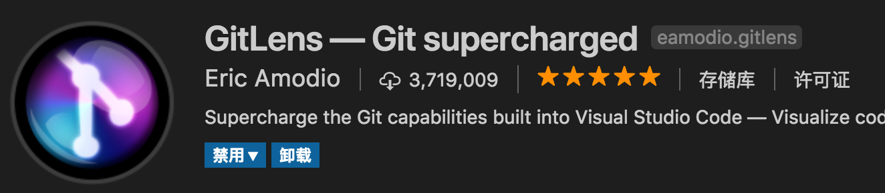

## 一般配置 
### 下载

[下载地址](https://code.visualstudio.com/)

 选择对应的操作系统版本，下一步、下一步安装即可。
 
### 切换语言
ctrl+shift+p 输入configure display language 下载需要的语言种类


### 皮肤
#### 界面：
快捷键：ctrl+k ctrl+t 


选择自己喜欢的编辑器、文本风格，也可以搜索并安装自己心仪的皮肤插件。

#### 图标：
点击file->preferences->File icon theme


选择自己喜欢的文件类型图标风格，也可以搜索并安装自己心仪的图标插件。

---


### 自定义字符组合
此功能可自定义一些特殊的字符组合，来完成快速输入的作用。

#### Example
需要定义一个快捷键来快速画一个圆
1、选择File->preferences->User Snippets
可以为全局配置、也可以为当前项目配置。

在JSON文件中键入
``` json
{
	// Place your snippets for javascript here. Each snippet is defined under a snippet name and has a prefix, body and 
	// description. The prefix is what is used to trigger the snippet and the body will be expanded and inserted. Possible variables are:
	// $1, $2 for tab stops, $0 for the final cursor position, and ${1:label}, ${2:another} for placeholders. Placeholders with the 
	// same ids are connected.
	// Example:
	"Print to console": {
		"prefix": "log",
		"body": [
			"console.log('$1');",
			"$2"
		],
		"description": "Log output to console"
	},
	"PIXI_Drawcircle": {
		"prefix": "pcircle",
		"body": [
			"let $1 = new PIXI.Graphics();",
			"$1.beginFill($2,$3);",
			"$1.drawCircle($4,$5,$6);",
			"$1.endFill();",
			"$7"
		],
		"description": "Draw a circle by PIXI"
	}
}
```
其中prefix代表输入内容，body代表需要键入的内容，description代表小提示，$代表变量名称。
保存后在编辑器中输入pcicle，可自动联想出对应的snippet。


### 自定义任务

#### Example
需求：自定义npm任务、自定义shell任务，并绑定快捷键

在项目中找到.vscode文件夹，新建、打开tasks.json文件。

键入以下内容：

``` json
{
    // See https://go.microsoft.com/fwlink/?LinkId=733558 
    // for the documentation about the tasks.json format
    "version": "2.0.0",
    "tasks": [
               {
            "label": "build",
            "type": "npm",
            "script": "build",
            "problemMatcher": [],
            "group": {
                "kind": "build",
                "isDefault": true
            }
        },
        {
            "label": "runServe",
            "type": "npm",
            "script": "start",
            "problemMatcher": []
        },
        {
            "type": "shell",
            "label":"runMakeJson",
            "command": "node ./makeJson.js",
            "problemMatcher": []
        }

    ]
}
```

可以直接按快捷键ctrl+shift+B 运行默认构建任务。

默认构建任务需要配置

```json
{"group": {
                "kind": "build",
                "isDefault": true
            }}
```

绑定快捷键

创建用户keybindings.json 键入

```json
[
    {
        "key": "F8",
        "command": "workbench.action.tasks.runTask",
        "args": "runMakeJson",
        "when": "editorTextFocus"
    },{
        "key": "F9",
        "command": "workbench.action.tasks.runTask",
        "args": "runServe",
        "when": "editorTextFocus"
    }
]
```

即可快捷的使用F8、F9、ctrl+shift+B执行操作。

### 自动保存
勾选File->Auto Save，妈妈再也不用担心我的电脑断电了~


## 常用插件

1. Auto Close Tag

自动闭合HTML/XML标签


2. Auto Rename Tag

自动完成另一侧标签的同步修改


3. Beautify

格式化代码，值得注意的是，beautify插件支持自定义格式化代码规则，例如：

``` json
{
  "indent_size": 4,
  "indent_char": " ",
  "css": {
    "indent_size": 2
  }
}
```

mac版vscode中beautify的默认格式化代码按键为cmd+b，也可以自定义快捷键


4. Bracket Pair Colorizer

给括号加上不同的颜色，便于区分不同的区块，使用者可以定义不同括号类型和不同颜色


5. Debugger for Chrome

映射vscode上的断点到chrome上，方便调试


6. ESLint

js语法纠错，可以自定义配置，不过配置较为复杂，建议使用网上一些广泛使用的eslint配置。


7. GitLens

方便查看git日志，git重度使用者必备。



8. HTML CSS Support

智能提示CSS类名以及id


9. HTML CSS Support

智能提示CSS类名以及id


10. JavaScript(ES6) code snippets

ES6语法智能提示，以及快速输入，不仅仅支持.js，还支持.ts，.jsx，.tsx，.html，.vue，省去了配置其支持各种包含js代码文件的时间


11. jQuery Code Snippets

jQuery代码智能提示


12. Markdown Preview Enhanced

实时预览markdown，markdown使用者必备


13. markdownlint

markdown语法纠错


14. Material Icon Theme

个人认为最好的vscode图标主题，支持更换不同色系的图标，值得点出的是，该插件更新极其频繁，基本和vscode更新频率保持一致


15. open in browser

vscode不像IDE一样能够直接在浏览器中打开html，而该插件支持快捷键与鼠标右键快速在浏览器中打开html文件，支持自定义打开指定的浏览器，包括：Firefox，Chrome，Opera，IE以及Safari


16. Path Intellisense

自动提示文件路径，支持各种快速引入文件


17. Vetur

Vue多功能集成插件，包括：语法高亮，智能提示，emmet，错误提示，格式化，自动补全，debugger。vscode官方钦定Vue插件，Vue开发者必备。


## 常用快捷键
mac ctrl键改为command键 alt键为option键。

### 编辑器
| 按键组合        | 功能    |
| --------   | -----:   |
|ctrl+`| 打开终端|
|ctrl+shift+`| 新建终端|
|ctrl+shift+p|打开命令面板|

### 选择

| 按键组合        | 功能    |备注|
| --------   | -----:   | ----- |
|ctrl+D|添加下一个匹配项| |
|ctrl+shift+L| 选择所有匹配项| 慎用，可能修改到不希望修改的内容 |
|alt+单击|添加一个光标| |

#### Example

添加下一个匹配项


添加一个光标


### 查找与替换
| 按键组合        | 功能    |
| --------   | -----:   |
|ctrl+F|文件中查找|
|ctrl+H|文件中替换|
|ctrl+shift+F|路径中查找|
|ctrl+shift+H|路径中替换|

### 复制
| 按键组合        | 功能    |
| --------   | -----:   |
|光标在行内时 ctrl+c|复制整行|
|alt+upArrow|将整行向上移动|
|alt+downArrow|将整行向下移动|

#### Example

整行移动


### 注释
| 按键组合        | 功能    |
| --------   | ----- |
|ctrl+/|行注释|
|shift+alt+A|块注释|


### 代码规整
shift+alt+F

## 调试程序

### Node.js

点击


创建launch.json配置文件

键入

``` json
{
    // 使用 IntelliSense 了解相关属性。 
    // 悬停以查看现有属性的描述。
    // 欲了解更多信息，请访问: https://go.microsoft.com/fwlink/?linkid=830387
    "version": "0.2.0",
    "configurations": [
        {
            "type": "node",
            "request": "launch",
            "name": "Launch Program",
            "program": "${file}"
        }
    ]
}
```

即可添加断点并开始调试node程序。

### Chrome

个人觉得比较鸡肋，有兴趣的同学可以自行百度。