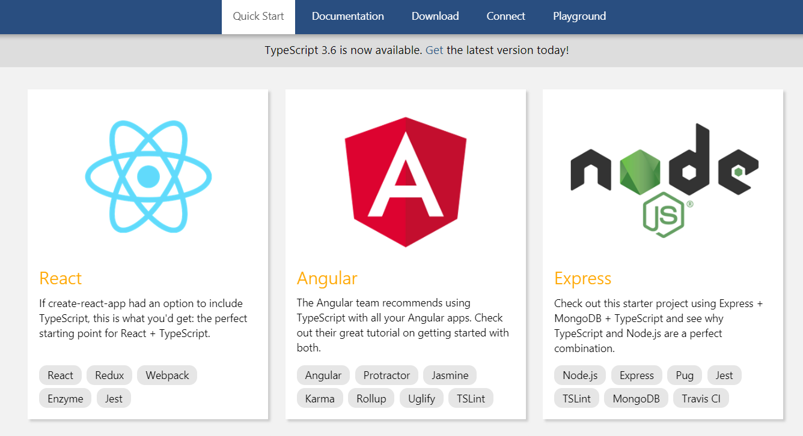
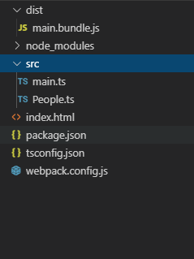

# Typescript
## Typescript介绍
### 什么是Typescript?
TypeScript是一种由微软开发的自由和开源的编程语言。它是JavaScript的一个超集，而且本质上向这个语言添加了可选的静态类型和基于类的面向对象编程。
[中文官网](https://www.TSlang.cn/)

### Typescript的优点
:::tip

* 安全的类型检查，更好的语义描述，强壮的代码提示，让开发效率更高，bug更少。</br> 

* 各大主流IDE都提供TS语法高亮功能，如VSCode,Webstorm,Atom,Hbuilder，并且IDE能够在您键入代码时提供更丰富的环境来发现常见错误。</br>

* 享用最新ES规范，毫不犹豫地享受最新API，如ES2020，纵情编写高质量的代码。</br>

* 使用TSloader取代babel,通过配置TSconfig,在浏览器版本都可以运行。</br>

* 更有效的团队协作，通过规范接口，制定泛型类型，让代码所见即知其意。
:::


### 我为什么要学Typescript
::: tip

+ 有“钱”景，例如Google的Angular本身就是TS写的,脸书的ReactTS版完美支持TS,尤大的Vue3也是TS重构的，还有国内的白鹭引擎也是TS的，因此不论国外和国内TS都是很火。
+ ES6，ES8，甚至ES2020，在typescript都是可以用的。
+ 方便后台的协作，能够大幅度提高工作效率。
+ 即便你不喜欢typescript强类型，也可以通过设置TSconfig来禁止TS进行类型检查，并且使用你熟悉的JavaScript进行编程，但好处是,ES6，ES8，甚至ES2020，在typescript都是可以用的。
+ 如果你喜欢前端技术，想要钻研更深入，更需要学习Typescript。
:::

## 第一行TS程序

### 我们来用TS上手搞一个小程序，叫《小明的一生》

::: tip
我们做一次造物主，创造一个人类蓝图，用它创建人物，他将拥有名字，职业，生命时长等属性，然后可以让他说话做自我介绍，通过这个案例，我们将第一次看到TS的魅力。
:::
```
你们好!我是小明呀，今年18岁了。
我的职业是程序员,我最多能活50年,还剩下32年就可以去极乐世界啦~
```

### 创建《小明的一生》项目

### 安装Webpack环境配置
::: warning
* 如果在5年前，你说自己做前端不会JQuery，很多人都会喷你是假前端，小菜鸟，而现在，如果你做前端却还不懂webpack，那和以前不会Jquery一样被嘲笑。
* 假设你了解过Webpack4,并且掌握最简单的打包方式。


:::
### 全局安装
```
npm i -g webpack webpack-cli typescript
```

### 项目初始化
```
npm init -y
```
```json
{
  "name": "xiaominglife",
  "version": "1.0.0",
  "description": "",
  "main": "./src/main.ts",
  "scripts": {
    "build": "webpack"
  },
  "keywords": [],
  "author": "",
  "license": "ISC"
}
```
### 在项目中安装
* #### 安装webpack,webpack-cli,typescript
```
npm i -D webpack webpack-cli typescript@next
```
* #### 安装ts模块解析器 awesome-typescript-loader 
```
npm i -D awesome-typescript-loader
```
::: tip
Webpack提供ts-loader，TS官方推荐awesome-typescript-loader，因为后者编译速度要更快。
:::
* #### 新建项目，新建一个src主程序目录，并创建一个主函数main.ts文件
* #### 新建tsconfig.json
```
tsc init
```


### TSconfig.json配置文件基础
::: tip
更多tsconfig.json配置，请查阅官网 [tsconfig配置教程](https://www.tslang.cn/docs/handbook/tsconfig-json.html)
:::


```json
{
	"compilerOptions": {
		"module": "commonjs",
		"target": "es5",
		"experimentalDecorators": true,
		"noEmitHelpers": false,
		"sourceMap": false,
		"outDir": "./dist/js",
		"lib": [
			"dom",
			"es2015",
			"es6",
			"es2016"
		]
	},
	"include": [
		"src/**/*"
	]
}

```

### 在src中创建main.ts,People.ts,整体目录结构


### 入口main.ts
``` ts
class People{
	private age:number = 18;
	protected name:string = '';
	public deathTime:number = 100;
	private job:string = '';
	constructor(name:string='无名',job:string='IT狗',age:number=18,deathTime:number=100){
		if(age>deathTime){
			throw Error('你的岁数不能超过死亡年限');
		}
		this.age = age;
		this.name = name;
		this.job = job;
		this.deathTime  = deathTime;
	}
	private getRestTime():number{
		return this.deathTime- this.age;
	}
	public say():void{
		console.log(`你们好!我是${this.name}呀，今年${this.age}岁了。\n我的职业是${this.job},我最多能活${this.deathTime}年,还剩下${this.getRestTime()}年就可以去极乐世界啦~`)
	}
}
export default People;
```

### 创建People.ts，人物类
``` ts
import People from './People'
class Main{
	constructor(){
		var man:People = new People('小明','程序员',18,50);
		man.say();
	}
}
new Main();
```
### 打包运行，完成！
``` 
npm run build
```


## 强类型
 
:::tip
Typescript最基本的概率，是强制类型,能方便阅读。
:::

### 布尔值
```ts
let isClicked:boolean = false; 
```
### 数字
::: warning
Typescript的数字能额外支持8进制和2进制
:::
```ts
let decLiteral: number = 6;
let hexLiteral: number = 0xf00d;
let binaryLiteral: number = 0b1010;//2进制
let octalLiteral: number = 0o744;//8进制
```
### 字符串
```ts
let slidebar_name:string = "slidebar3";
let content_name: string = `Hello, my name is ${ slidebar_name }.`;
```
### 数组
``` ts
let books_list: number[] = [1, 2, 3];
let list: Array<number> = [1, 2, 3];//泛型类表示法
```

### 元组
::: tip
Tuple是表示有顺序，有类型的特定数组
:::
```ts

let x: [string, number]=['hello', 10]; // OK
x = [10, 'hello']; // Error
```

### 枚举
:::tip
* 枚举类型，是对JS标准类型的一种补充，类似数组，有对应下标(键值对)
* 以手动的指定成员的数值
* 枚举类型可以由枚举的键值得到它的键名
:::

#### 更改元素起点编号
```ts
enum Color {Red = 1, Green, Blue}//Red后面的枚举名可以不用指定枚举值，默认从首枚举值递增
let c: Color = Color.Green; //2
```
::: warning 思考
下面输出是多少？
:::
```ts
enum RI {A=0,X,F,B=2,C} 
console.log(RI.X,RI.F,RI.C)
```
#### 枚举的值可以反向映射到枚举的名
``` ts
enum Color {Red = 1, Green, Blue}
let colorName: string = Color[2];//输出Green
```
### Any
:::tip
Any类型可以让TS不对其进行类型检查，一般当我们在申明不确定类型的变量时候可以用到。
:::
```ts
let notSure: any;//声明一个可以拥有任意值的类型any;
notSure = 11;
notSure = new Object();
notSure = "hello world"
```

### Void
:::tip
Void表示空类型，和any是对立的，在申明void变量时表示null和undefined，在表示函数返回时void表示不返回任何值
:::
```ts
let u: undefined = undefined;
let n: null = null;
let clickhandler = function Clicked():void{

}
```

### Object
::: tip
所有基础类型以外的数据类型，都可以用object表示
:::
```ts
function create(o: object | null): void{};
create({x:1});
create(1);
create('ok');
```


---
## 变量声明
### 块级作用域let
::: warning
思考下面会输出什么?
:::
```js
for (var i = 0; i < 10; i++) {
   setTimeout(function() { console.log(i); }, 100 * i);
}

```
你可能不暇思索的就说，是1~10这几个数字，但并非如此。
我们再试试利用IIFE会怎样
```js
for (var i = 0; i < 10; i++) {
    (function(i) {
        setTimeout(function() { console.log(i); }, 100 * i);
    })(i);
}
```
现在是满意的结果，但有let，我们可以这么写
### 将var写成let
``` js
for (let i = 0; i < 10; i++) {
    (function(i) {
        setTimeout(function() { console.log(i); }, 100 * i);
    })(i);
}
```
### let的核心知识点
* 用let取代var
* 所有的不可被重写入的变量，统一用const声明，这样可以让我们更容易的推测数据的流动。
* 当用let声明一个变量，块作用域变量在包含它们的块或for循环之外是不能访问的。
```js
for (let i = 0; i < 10; i++) {
   setTimeout(function() { console.log(i); }, 100 * i);
}
console.log(i);
```
* 块级作用域变量它们不能在被声明之前读或写
```js
console.log(a);  
let a;

```
---
## 接口
:::tip
TS最伟大的东西就是接口。
TypeScript的核心原则之一是对值所具有的结构进行类型检查， 接口的作用就是为这些类型命名和为你的代码或第三方代码定义契约。
:::

### 定义接口
#### 如果没有接口，就是下面的这样
```ts
function getStuAnswer(obj = {
	userAnswer:'A',
	rightAnswer:'B',
	level:1,
	isRight:0,
	isComplete:false
}){
... ...
}
//下面你根本不知道参数里要传哪些东西，没有任何代码提示
getStuAnswer({
	... ...
})
```

#### 使用接口
```ts
interface IStuAnswer{
	userAnswer:string,
	rightAnswer:string,
	level?:number,
	isRight?:number,
	isComplete:boolean
}

function getStuAnswer(obj:IStuAnswer = {
	userAnswer:'A',
	rightAnswer:'B',
	level:1,
	isComplete:false
}){

}

```
### 只读属性
```ts
interface Point {
    readonly x: number;
    readonly y: number;
}
```

### 函数类型
```ts
interface SearchFunc {
  (source: string, subString: string): boolean;
}
```

### 实现接口(类的锲约)
:::tip
一个类可以强制符合某个契约，通过implements关键字，让该类必须实现该接口的所有方法和定义的成员。
实现的所有方法和成员必须是Public
:::
```ts
interface ClockInterface {
    currentTime: Date;
	getTime(v:number):number;
}

class Clock implements ClockInterface {
    public currentTime: Date;
    constructor(h: number, m: number) { }
	getTime(v):number{
		return v;
	}
}

```

### 接口继承
:::tip
继承的本质，在ES5中是通过对象原型链的属性共享原则来实现。
一个接口可以继承一个或者多个不同的接口。
:::
```ts
interface IShape {
    color: string;
}
interface ISquare extends IShape {
    sideLength: number;
}

let square = <ISquare>{};
square.color = "blue";
square.sideLength = 10;
```
#### 可以继承多个

```ts
interface IShape {
    color: string;
}
interface IOutface {
    size:number;
}
interface ISquare extends IShape,IOutface {
    sideLength: number;
}

let square = <ISquare>{};
square.color = "blue";
square.sideLength = 10;
square.size = 100;
```

---
## 理解泛型
### 什么是泛型
:::tip
通常是一某种函数（或者组件），它接受任意的预定类型，在代码编译前，TS检查器可以捕获对该函数的操作，是否符合预定类型的规范， 这种操作简称泛型
:::

### 泛型函数
:::tip
* 泛型函数是典型的泛型模型，接受某种数据类型，返回值也是某种数据类型的值
* 它和普通函数几乎没有区别，就是在函数小括号前面加一个泛型的类型标识。
:::
 

::: danger
如果不用泛型，思考下面几个函数的执行会有什么问题？
```ts
function identity(arg:any){
	return arg;
}
identity(12).length;
identity(['a','b','c']).length;
identity('hello').length;
identity(true).length;
identity({x:100}).length;
```
:::
上面编辑器不会报错，但是使用泛型，可以利用TS代码检查中抛出错误
```ts
function identity<T>(arg:T):T{
	return arg;
}
identity<number>(12).length;
identity<Array<string>>(['a','b','c']).length;
identity<string>('hello').length;
identity<boolean>(true).length;
identity<object>({x:100}).length;
```
#### 定义泛型函数
```ts
function identity<T>(arg: T): T {
    return arg;
}
let output = identity<string>("myString");
```

### 泛型类型
:::tip
函数类型的变量声明，是采用"(arg:any)=>any"这样的格式的
:::
``` ts
var getAnyNumber:(arg:number)=>number = function(v):number{
	return v;
}
```
 泛型类型的定义是这样：
``` ts
function identity<T>(arg: T): T {
    return arg;
}
let output:<T>(arg:T)=>T = identity;
```
### 泛型接口
```ts
interface GenericIdentityFn<T> {
    (arg: T): T;
}

function identity<T>(arg: T): T {
    return arg;
}

let myIdentity: GenericIdentityFn<number> = identity;
```

### 泛型类
```ts
class GenericNumber<T> {
    zeroValue: T;
    add: (x: T, y: T) => T;
}

let myGenericNumber = new GenericNumber<number>();
myGenericNumber.zeroValue = 0;
myGenericNumber.add = function(x, y) { return x + y; };
```


---
## 主流前端框架+Typescript

### 基本配置
在进行Vue+Typescript之前，假设你已经自己掌握了webpack搭建自动化脚手架工具：
[Vue&TypeScript](https://segmentfault.com/a/1190000011744210?utm_source=tag-newest)
:::  tip
 官方推荐的React+Typescript搭建项目教程
[React&TypeScrit](https://www.tslang.cn/docs/handbook/react-&-webpack.html)
:::

### Vue&TypeScript
::: tip 优势
* 使用vue+typescript，可以利用完全面向对象的语法编写你Vue程序，摆脱了字面量对象语法
* vue-property-decorator装饰器极大提升了开发效率
* vuex-class装饰器让vuex写起来更加简单
:::

[vue-propery-decorator教程](https://www.jianshu.com/p/d8ed3aa76e9b)

### 安装

安装依赖项目
```cmd
npm i -S vue-property-decorator vue-class-component vuex vuex-class
```
``` json
  "dependencies": {
    "@types/gsap": "^1.20.2",
    "@types/pixi.js": "^4.8.8",
    "axios": "^0.19.0",
    "fastclick": "^1.0.6",
    "gsap": "^2.1.3",
    "pixi-sound": "^2.1.4",
    "pixi-spine": "^1.5.23",
    "pixi.js": "^4.8.8",
    "swiper": "^4.5.0",
    "vue": "^2.6.10",
    "vue-class-component": "^7.1.0",
    "vue-property-decorator": "^8.1.1",
    "vuex": "^3.1.1",
    "vuex-class": "^0.3.2"
  }
  ```

### @Component({})
#### TS版本
```ts
import {Vue,Component} from 'vue-property-decorator'
@Component({
	components:{
		Menu
	}
})
export default class App exnteds Vue{
	textname:string = 'zz';
	inputvalue:string='';
	get inputval(){
		return this.inputvalue;
	}
	set inputval(value:number){
		this.inputvalue = value;
	}
	set inputval(){}
	overcheck(){
		console.log('checked');
	}
	mounted(){

	}

}

```
#### JS版本
```js
import Vue from 'vue'
export default{
	components:{
		Menu
	},
	data(){
		return{
			textname:'zz',
			inputvalue:''
		}
	},
	computed:{
		set(val){
			this.inputvalue = val;
		},
		get(){
			return this.inputvalue;
		}
	},
	methods:{
		overcheck(){
			console.log('checked')
		}
	},
	mounted(){

	}
}

```


### @Prop
#### TS版本
```ts
import {Vue,Component,Prop} from 'vue-property-decorator'
@Component
export default class App exnteds Vue{
	 @Prop({default:true,type:Boolean})
	 isOpened:boolean;
	 @Prop(Number)
	 maxNumber:number;
}
```
#### JS版本
```js
import Vue from 'vue'
export default{
	props:{
		isOpened: {
			type: Boolean,
			default: true
		},
		maxNumber:{
			type:Number
		}
	}
}
```


### @Emit

#### TS版本
```ts
import {Vue,Component,Emit} from 'vue-property-decorator'
@Component
export default class App exnteds Vue{
	@Emit()
	clickme(val:number){
		return val;
	}
}
```
#### JS版本
```js
import Vue from 'vue'
export default{
	methods:{
		clickme(val){
			this.$emit('clickme',val);
		}
	}
}
```


### @Watch

#### TS版本
```ts
import {Vue,Component,Watch} from 'vue-property-decorator'
@Component
export default class App exnteds Vue{
	state_children = [];
	@Prop(Array)
	childarray:array;
	@Watch('childarray',{immediate:true,deep:true})
	watchHandler(newval,oldval){
		this.state_children = newval.concat();

	}
}
```
#### JS版本
```js
import {Vue} from 'vue'
export default{
	data(){
		return{
			state_children = []
		}
	},
	props:{
		childarray:{
			type:Array,
			default:function(){
				return []
			}
		}
	},
	watch:{
		'childarray': {
			handler: 'watchHandler',
			deep: true,
			immediate:true
		},
	},
	methods:{
		watchHandler(newval,oldval){
           	this.state_children = newval.concat();
		}
	}


}
```


### 范例
``` vue
<template>
  <div class="UfoStyle">
    <div v-show="showMonster" class="monster" :style="monster_bgsrc">
      
    </div>
    <div class="ufoBody" :style="ufo_bgsrc">
      <div class="textband" :style="textband_bgsrc"></div>
      <div class="progressband">
        <div class="progress_bottom" :style="progress_bottom"></div>
        <div class="progress_mask" :style="{width:progress+'rem'}">
          <div class="progress_uppon" :style="progress_uppon"></div>
        </div>
      </div>
    </div>
    <div ref="bubbleball" class="bubble" :style="bubble_bgsrc"></div>
    <div class="bubble" v-if="locked" :style="bubblelock_bgsrc"></div>
  </div>
</template>
<script lang="ts">
import { Vue, Component, Prop, Watch } from "vue-property-decorator";
import GlobalData from "../../store/GlobalData";
import { State } from "vuex-class";
import { TweenMax } from "gsap";

@Component({})
export default class MonsterUfo extends Vue {
  @State myname;
  @Prop(String)
  textbandsrc: string;
  @Prop(String)
  monstersrc: string; //怪物皮肤;
  @Prop(Number)
  progress: number; //章节进度条;
  @Prop(Boolean)
  lock: boolean; //是否锁定;
  @Prop(Boolean)
  hideBubble: boolean;
  @Prop({ default: false, type: Boolean })
  showMonster: boolean;
  locked: boolean = true;
  @Watch("hideBubble")
  watchHideBubble(newval, oldval) {
    if (newval === true) {
      this.bubble_alphaTo(0);
    } else {
      this.bubble_alphaTo(1);
    }
  }
  @Watch("lock", { immediate: true })
  watchLockedHandler(newval, oldval) {
    this.locked = newval;
    if (newval === false) {
      this.monster_bgsrc.zIndex = 10;
    } else {
      this.monster_bgsrc.zIndex = 0;
    }
  }
  progress_bottom = {
    background: `url("${GlobalData.publicURL}${GlobalData.gameConfig.publicUrl.mainpage_progress_bottom}") no-repeat`,
    backgroundSize: "100% 100%"
  };
  progress_uppon = {
    background: `url("${GlobalData.publicURL}${GlobalData.gameConfig.publicUrl.mainpage_progress_uppon}") no-repeat`,
    backgroundSize: "100% 100%"
  };
  textband_bgsrc = {
    background: `url("${GlobalData.publicURL}${this.textbandsrc}") no-repeat`,
    backgroundSize: "100% 100%"
  };
  monster_bgsrc = {
    width: "4.49rem",
    height: "auto",
    zIndex: 0
  };
  ufo_bgsrc = {
    background: `url("${GlobalData.publicURL}${GlobalData.gameConfig.publicUrl.pubconf_mainpage_ufo}") no-repeat`,
    backgroundSize: "100% 100%"
  };
  bubblelock_bgsrc = {
    background: `url("${GlobalData.publicURL}${GlobalData.gameConfig.publicUrl.pubconf_mainpage_bubblelock}") no-repeat`,
    backgroundSize: "100% 100%"
  };
  bubble_bgsrc = {
    background: `url("${GlobalData.publicURL}${GlobalData.gameConfig.publicUrl.pubconf_mainpage_bubble}") no-repeat`,
    backgroundSize: "100% 100%"
  };
  get monsterUrl() {
    return `${GlobalData.publicURL}${this.monstersrc}`;
  }
  public bubble_alphaTo(value: number) {
    let bubbleball: HTMLDivElement = this.$refs.bubbleball as HTMLDivElement;
    TweenMax.to(bubbleball, 0.3, {
      alpha: value
    });
  }
}
</script>
```
---