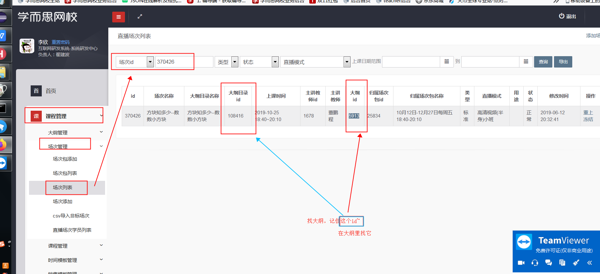
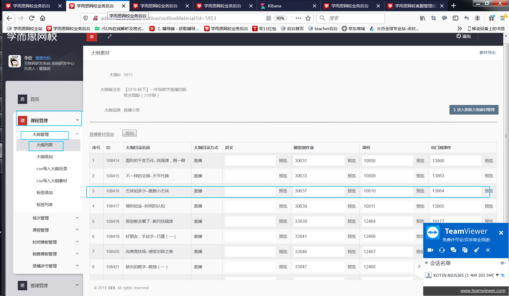
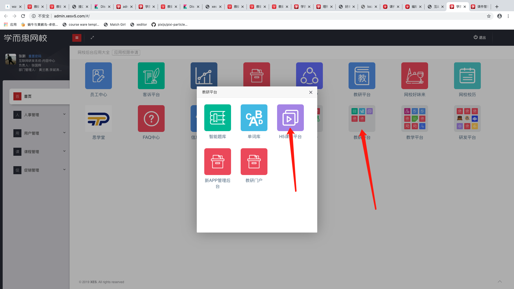
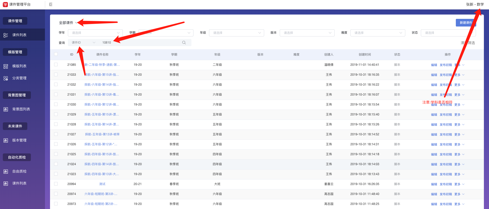
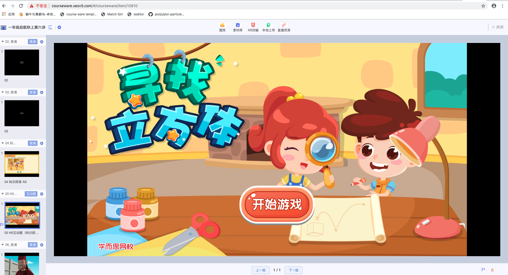
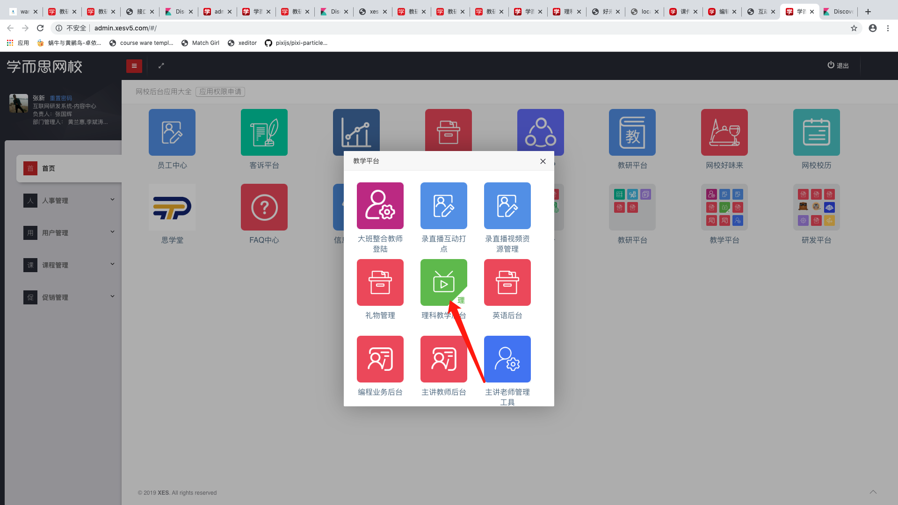
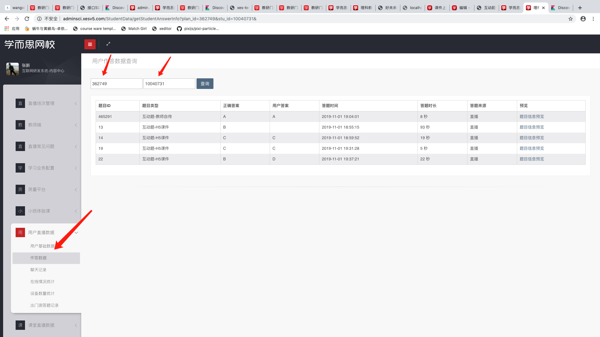
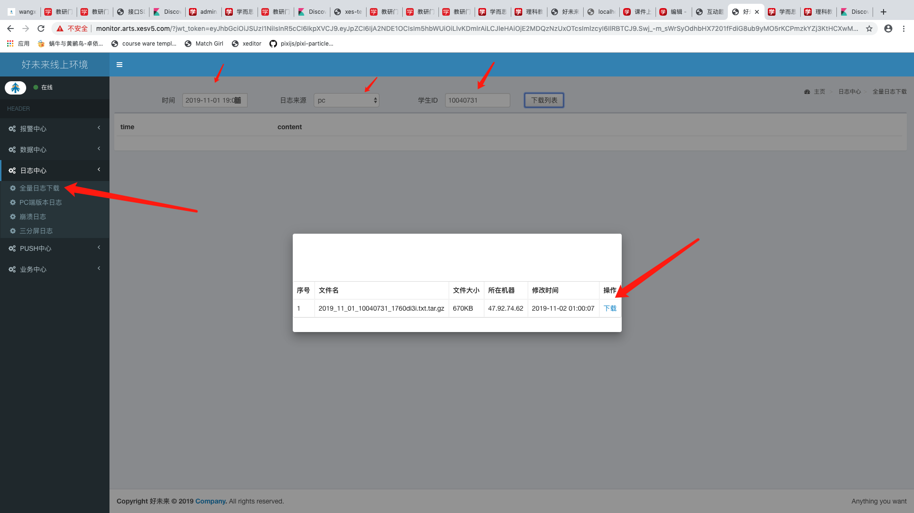
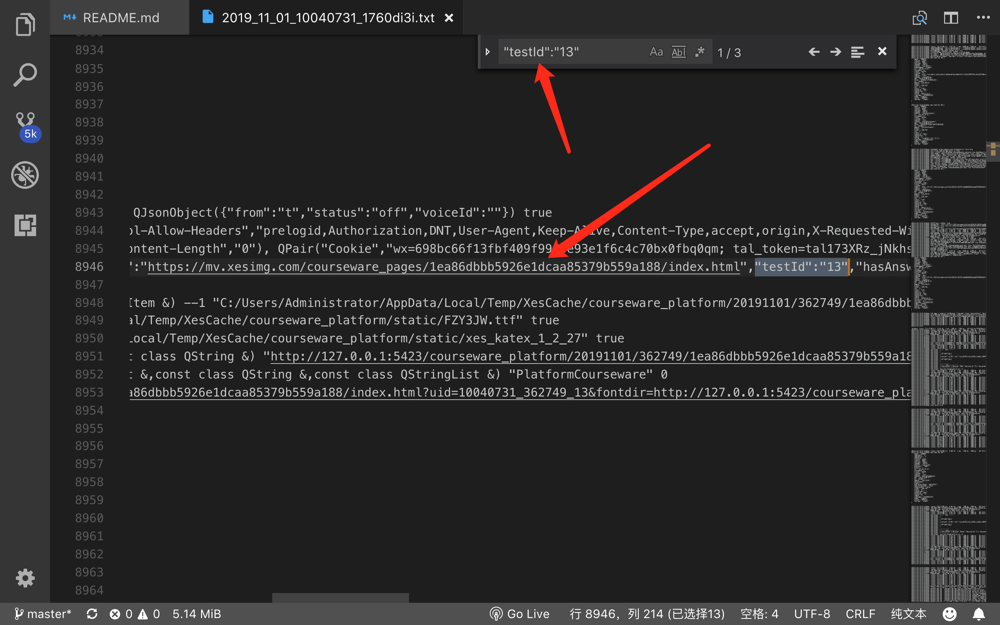

## 查找课件id
[课件平台](http://admin.xesv5.com/#/)
### 示例:
* 根据客诉提供的场次id，查找到相应的课件id，然后在课件平台查找到相应的课件
1.

2.

3.

4.

5.

## 查询作答信息
1.

2.

## 查询各端互动题相关日志

[日志中心](http://monitor.arts.xesv5.com/)

1.

2.根据试题id查到相应课件链接(试题id来源于上面作答记录)

