## 自动建课链接
[建课链接](http://192.168.125.39:8080/CreateCourseOnlineEnvironment/)
### 示例:
1.
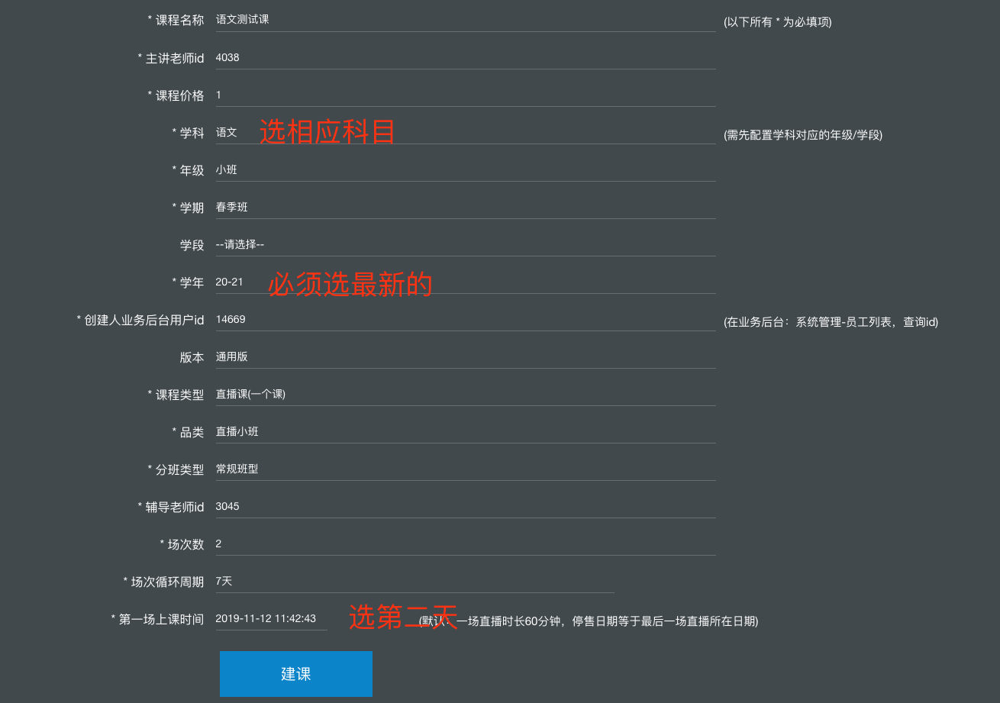
2.

[课件平台](http://192.168.125.39:8080/CreateCourseOnlineEnvironment/)  

3.
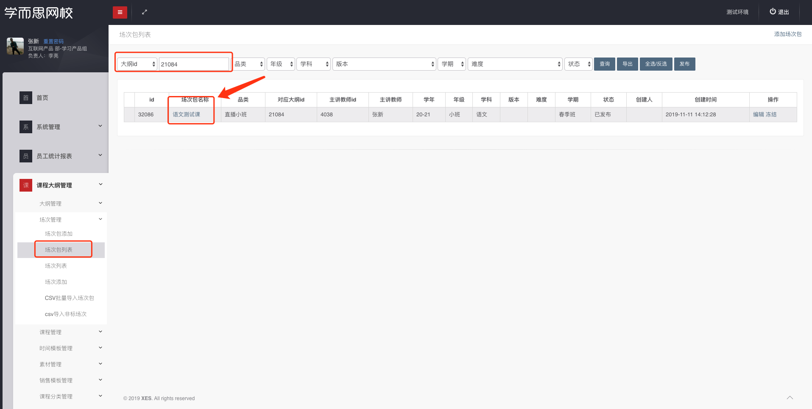
4.
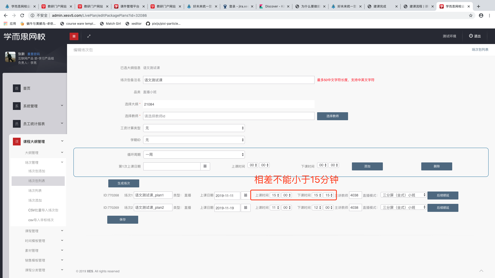
5.
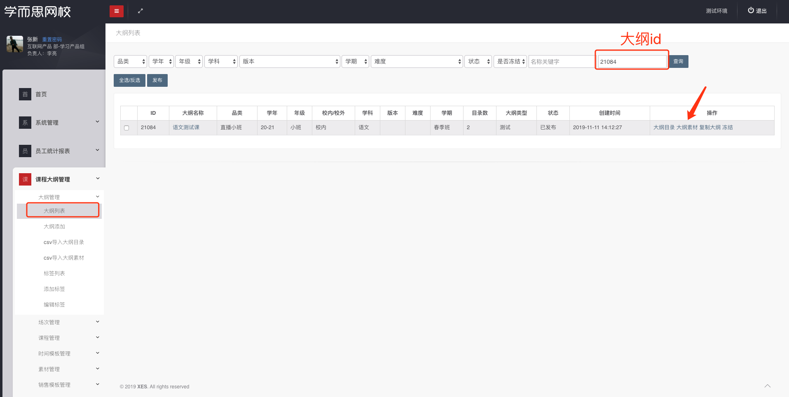
6.
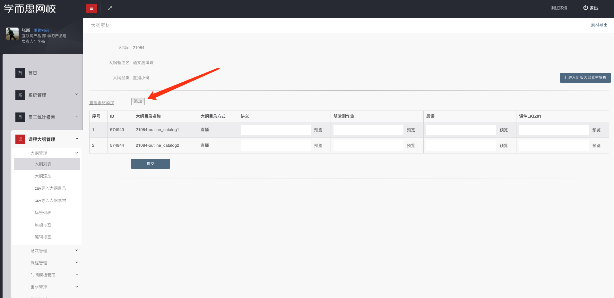

[课件平台](http://courseware.xesv5.com/#/courseware/list)  

7.
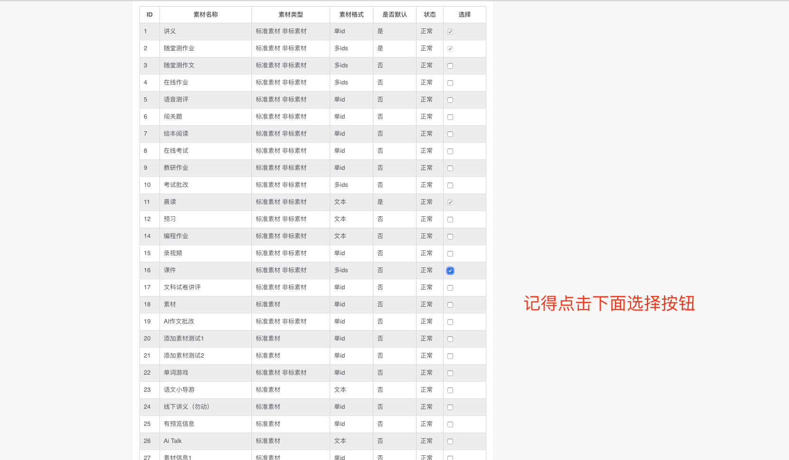
8.
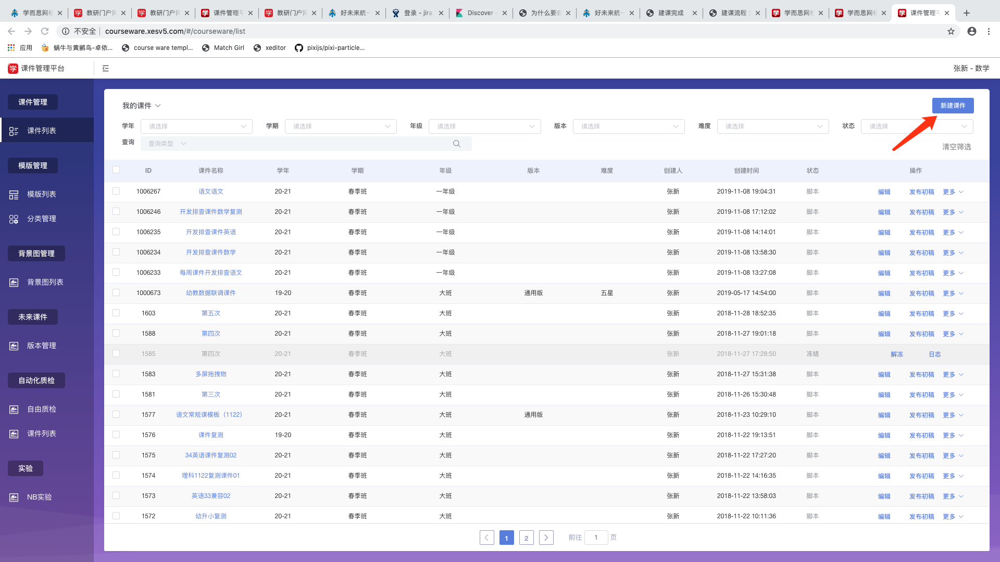
9.
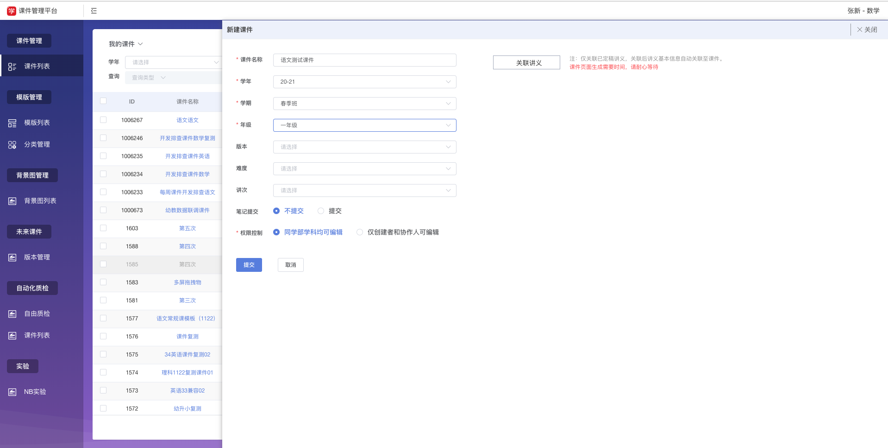
10.
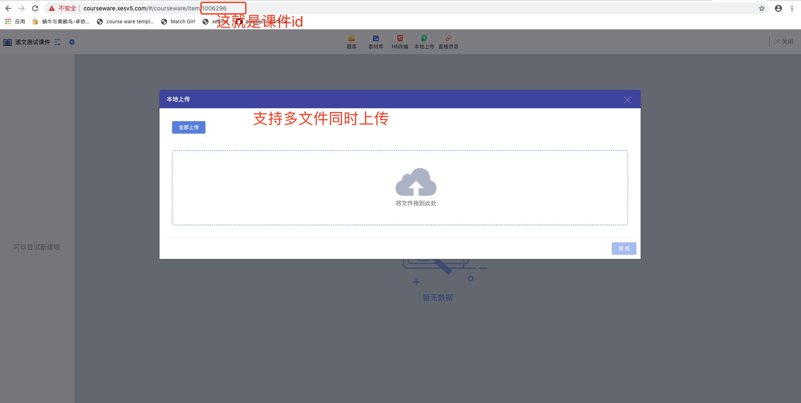
11.
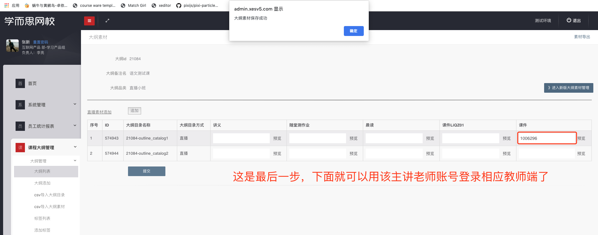

12.
[买课链接](https://www.xueersi.com/course-detail/63532)  

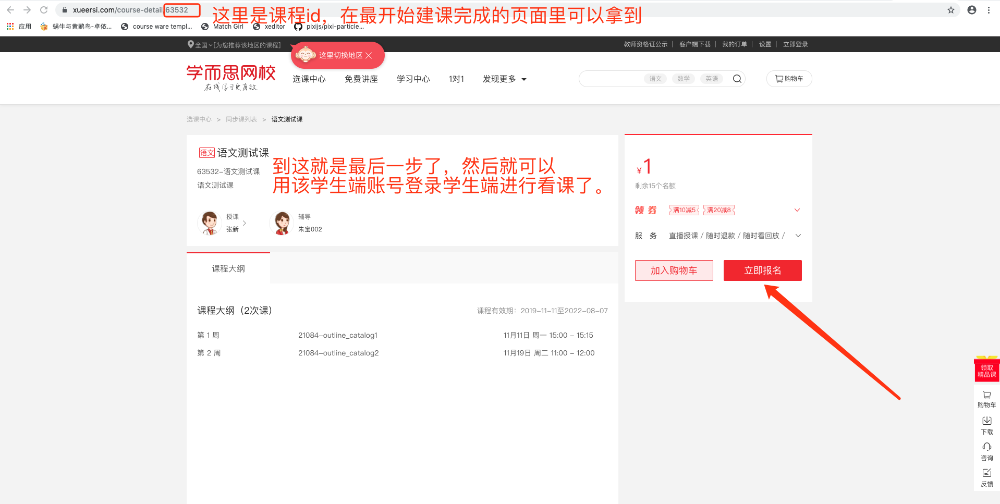

