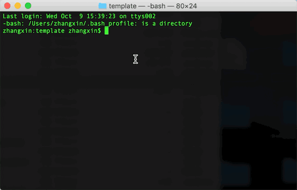

## 组课工具版模板

### 项目地址:
<a href="https://git.100tal.com/wangxiao_neirongchanpinbu_H5_template/course-template" target="_Blank">传送门</a>  

``安装脚手架构建工具``
```
// 安装一次即可
npm i xtemplate-cli -g 
```
``clone``
```
git clone https://git.100tal.com/wangxiao_neirongchanpinbu_H5_template/course-template.git
```
``安装依赖``
```
$ cd course-template
$ npm i
$ xtemcli update
```
``创建相应模板``
```js
* 在项目根目录下执行
* 如果create失败，请更新xtemplate-cli
$ xtemcli create <template name>  //name为模板名称，命名规则详见下面<模板名称命名规范>
```
``模板名称命名规范``   
```
【学科-模板名】*模板名以需求文档上名称为准
学科后面的英文依次代表语文(chinese)、数学(math)、英语(english)、公共(common)
例:苹果演算  【 math-apple-calculus】
```
``开发环境如自己删除node_modules后,须执行以下指令``  
```js
* 在项目根目录下执行
$ npm i 
$ xtemcli update
```
``生成resource.json，适用于个性课件``  
```js
* 在项目根目录下执行
xtemcli resource <template name>
```
``示例``  



## 编辑器版模板
### 项目地址:
<a href="https://git.100tal.com/wangxiao_neirongchanpinbu_H5_template/course-template-editor.git" target="_Blank">传送门</a> 

``安装脚手架构建工具``
```
// 安装一次即可
npm i xeditor-cli -g
```
``clone``
```
git clone https://git.100tal.com/wangxiao_neirongchanpinbu_H5_template/course-template-editor.git
```
``安装依赖``
```
npm ci
```
``创建相应模板``
```
* 根目录执行即可
xeditor create <template name>
```
``导入相应资源``
```
* 在编辑器一系列布局之后，导出资源到public/<template name>
```
``运行codeing``
```
npm run serve --dir=<template name>
```
``编译发布``
```
* 打包成本地版本(可直接在本地打开，不可被编辑器二次编辑生成课件)
npm run build_local --dir=<template name>

* 打包成线上使用版本(上传至模板库,线上编辑组课发布生成课件)
npm run build_line --dir=<template name>
```
``示例``  


